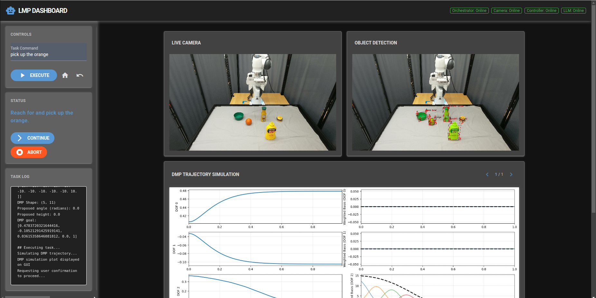

# Language Movement Primitives: Grounding Language Models in Robot Motion

[[arXiv](https://arxiv.org/pdf/2602.02839)] [[Project Website](https://collab.me.vt.edu/lmp/)]

Implementation of Language Movement Primitives (LMP), a framework that grounds VLM reasoning in Dynamic Movement Primitive (DMP) parameterization. 



## Setup Instructions

### 1 Installation
Clone the repository with submodules and sync the dependencies:
```bash
git clone https://github.com/lmp-26/lmp-26.github.io.git
cd LMP
git submodule update --init --recursive

uv sync
```

**Optional: Dynamic Object Tracking**
Download the DEVA tracking weights if you want to use dynamic object tracking,:
```bash
mkdir -p src/camera/Tracking-Anything-with-DEVA/saves
wget -P src/camera/Tracking-Anything-with-DEVA/saves/ https://github.com/hkchengrex/Tracking-Anything-with-DEVA/releases/download/v1.0/DEVA-propagation.pth
```

### 2 Configuration
Copy the sample environment file and fill in your API keys:
```bash
cp src/.sample_env src/.env
# Edit src/.env with your GENAI_API_KEY, GPT_API_KEY, etc.
```

## Running the System

To run the full LMP system, you need to open **5 separate terminals** and run the following commands in order:

### Terminal 1: Graphical User Interface
The dashboard interface for monitoring and task execution with WebGUI.
```bash
uv run src/gui.py
```

### Terminal 2: Camera Server
Manages the Orbbec camera feed and object tracking.
```bash
uv run src/camera/orbbec.py --FastAPI
```

### Terminal 3: LLM DMP Generator
The LLM-based service that generates DMP weights.
```bash
uv run src/lmp/llm_dmp_generator.py
```

### Terminal 4: Task Orchestrator
Coordinates high-level task logic and communication between services.
```bash
uv run src/lmp/orchestrator.py
```

### Terminal 5: Robot Controller
Interfaces with the physical robot to execute the DMP trajectories.
```bash
uv run src/controller.py
```

---
Once all services are running, open your browser to the URL displayed in Terminal 1 (usually `http://localhost:8040`) to start interacting with the robot.

## Running the Baseline 

### TrajGen [[arXiv](https://arxiv.org/pdf/2310.11604)]

To run the TrajGen baseline, you can skipping the LLM DMP Generator and standard Task Orchestrator in terminal 3 and 4:


1. **Terminal 1: Graphical User Interface**: `uv run src/gui.py`
2. **Terminal 2: Camera Server**: `uv run src/camera/orbbec.py --FastAPI`
3. **Terminal 3: Robot Controller**: `uv run src/controller.py`
4. **Terminal 4: TrajGen Baseline**:
   ```bash
   uv run src/trajgen_baseline/main.py
   ```

### Pi0.5 [[repo](https://github.com/Physical-Intelligence/openpi)]
**Train:**
Clone the repo, first build datasets and set training configurations according to `src/pi0_baseline/training_config.py`, then compute the normalization statistics.
Setup training script based on `src/pi0_baseline/train.sh`.


**Test:**
To run the Pi0.5 baseline, you need to run the camera publisher and the deployment script:

1. **Terminal 1: Graphical User Interface**: `uv run src/gui.py`
2. **Terminal 2: Robot Controller**: `uv run src/controller.py`
3. **Terminal 3: Camera Publisher**:
   ```bash
   uv run src/pi0_baseline/cameras_publisher.py
   ```
4. **Terminal 4: Policy Server (Can be remotely)**: `uv run scripts/serve_policy.py policy:checkpoint --policy.config=LMP --policy.dir=checkpoints/LMP/my_experiment/20000` 
5. **Terminal 5: Deploy Pi0.5**:
   ```bash
   uv run src/pi0_baseline/deploy.py
   ```

## Citation

If you find this work useful, please cite our paper:

```bibtex
@article{dai2026language,
    title={Language Movement Primitives: Grounding Language Models in Robot Motion},
    author={Dai, Yinlong and Christie, Benjamin A and Evans, Daniel J and Losey, Dylan P and Stepputtis, Simon},
    journal={arXiv preprint arXiv:2602.02839},
    year={2026}
}
```
